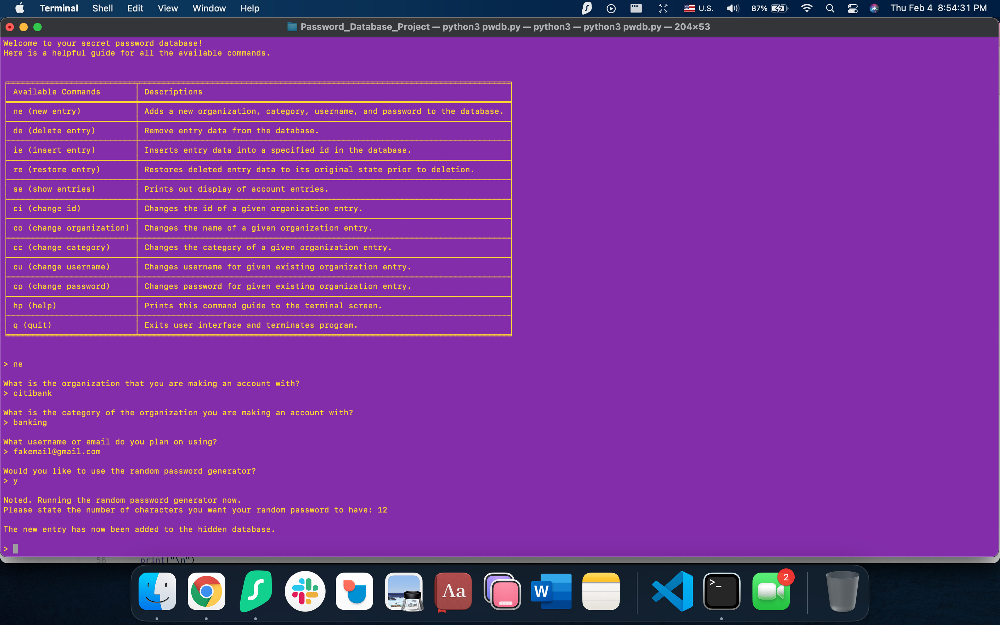
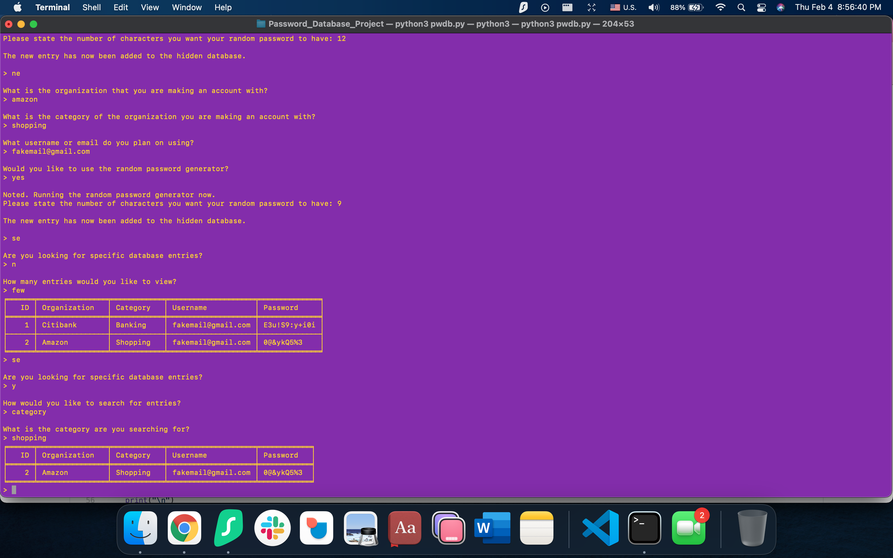

# Password Database Project

This project arose from my need to have a free and secure place to store my passwords on my computer as well as
a way to practice and improve upon my understanding of SQL databases.

1. Importation: Imported Python module PwordGen that originated from the script PwordGen.py that I wrote for a
past project to make a random password generator. The incorporation of this module would be for the purpose of
allowing the user the choice of generating a random password when they input an entry into the database.

2. Methods: Used initiate() method to ensure secure login through the use of a master password, guide() method
to display the list of all possible commands to the user, toString() and display() method to provide visual
tabular display of the database to the user, orgcheck() method to check for the existence of an organization
that the user may search for in the database and interface() method to interpret user input commands.

3. Display Example: Here are screenshots of how the database appears in my terminal.

